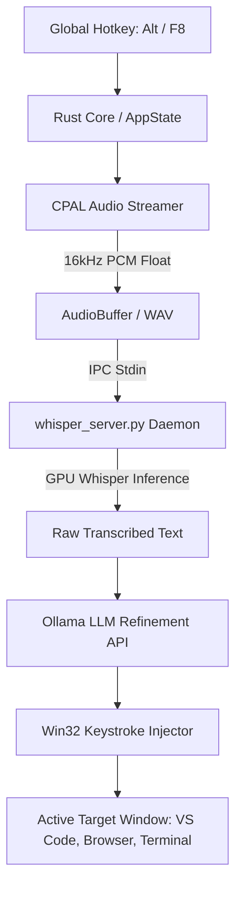

# Project Specification & Living Build Log: AetherVoice

## 1. Executive Summary & Vision
- **Objective**: 100% Free, Local-First, Zero-Cloud Speech-to-Text Dictation desktop application. High-fidelity privacy-respecting alternative to Aqua Voice.
- **Core Principles**: Local-first processing, zero cloud dependency, low-latency keystroke injection, sleek ethereal UI widget.
- **Target OS / Platform**: Windows 10/11 x86_64 (`x86_64-pc-windows-gnu` / `msvc`).

---

## 2. Technical Stack, Toolchains & Dependencies
- **Frontend**: Vite 8 + TypeScript + Vanilla CSS (Transparent floating capsule HUD & multi-tab settings).
- **Desktop Shell**: Tauri v2 (`@tauri-apps/api: ^2`).
- **Core Engine**: Rust 2021 (`x86_64-pc-windows-gnu` / `msvc`), `cpal 0.15` audio capture, `windows-sys 0.59.0` (Win32 API bindings).
- **Speech Engine**: GPU Whisper (`whisper-large-v3-turbo`, `medium.en`, `base.en`) managed via persistent `whisper_server.py` IPC daemon.
- **AI Reasoning / Formatting**: Local Ollama server (`127.0.0.1:11434`) supporting Gemma 2, Llama 3.2, Qwen 2.5, DeepSeek R1, Mistral.
- **Packaging / Installer**: NSIS standalone installer with custom automated dependency installer hooks (`installer_hooks.nsh`).

---

## 3. Architecture & Data Flow

---

## 4. Current Implementation Progress & Milestones
- [x] **Phase 1: Project Initialization & Toolchain Setup**
- [x] **Phase 2: Core Speech & Dictation Engine (Whisper + Ollama)**
- [x] **Phase 3: Settings Dashboard, Audio Devices, Hotkeys & Replacements**
- [x] **Phase 4: Single-Instance Process Recognition**
  - Mutex-backed single-instance lock (`Global\AetherVoice_SingleInstance_Mutex`).
  - Native system modal alert preventing duplicate instances and notifying user of active instance in tray/screen.
- [x] **Phase 5: Automated Prerequisites & Setup Packaging**
  - NSIS custom installer hook (`installer_hooks.nsh`) dynamically detecting and provisioning Python, Whisper, PyTorch, audio dependencies, and Ollama.
  - Bundling and path resolution for `whisper_server.py` across development and production install directories.
- [x] **Phase 6: GitHub Release Distribution**

---

## 5. Verified Working Capabilities (Proven State)
- **Single-Instance Enforcement**: Verified via Win32 `CreateMutexW` and `GetLastError() == ERROR_ALREADY_EXISTS`. Triggers native modal alert `MessageBoxW` and clean shutdown when launched multiple times.
- **Automated Setup Prerequisites**: Integrated into NSIS setup installer bundle (`AetherVoice_0.1.0_x64-setup.exe`), inspecting/installing Python, PyTorch, Whisper, and Ollama with a visible progress window during installation.
- **In-App Self-Healing Whisper Engine**: If a user runs without prerequisites pre-installed, AetherVoice detects the missing `whisper` module, informs the user with a modal notice, and automatically runs `pip install` in the background with `py` and `python` launcher fallbacks.
- **Whisper Server Resolution**: Auto-locates `whisper_server.py` from executable root or resources bundle directory.
- **Standalone Setup EXE Generation**: Compiled release installer located at `src-tauri/target/release/bundle/nsis/AetherVoice_0.1.0_x64-setup.exe`.

---

## 6. Load-Bearing Decisions & Gotchas Resolved
- **Windows-sys 0.59.0 Feature Requirements**: `CreateMutexW` requires the `Win32_Security` and `Win32_Foundation` features in `Cargo.toml`.
- **MessageBoxW Null Mutability**: Win32 `MessageBoxW` expects a mutable pointer for `HWND` (`core::ptr::null_mut()`).
- **Visible NSIS Prerequisite Execution**: Replaced silent background execution in NSIS with `ExecWait` console execution so users see active pip/winget progress rather than failing silently.
- **Python / Py Launcher Fallback**: Added fallback checking for both `python` and `py` commands on Windows to support all Python installation variations.

---

## 7. Immediate Next Steps (Laptop / Desktop Crossover)
1. Commit and push updated code to GitHub (`main` branch).
2. Upload the freshly built `AetherVoice_0.1.0_x64-setup.exe` to GitHub Releases.
3. Validate download and run installer on secondary/target workstation.

---

## 8. Run & Verification Runbook
- Frontend build: `npm run build`
- Rust check: `cargo check` (in `src-tauri`)
- Bundle NSIS installer: `npx tauri build --bundles nsis`
- Output installer: `src-tauri/target/release/bundle/nsis/AetherVoice_0.1.0_x64-setup.exe`
